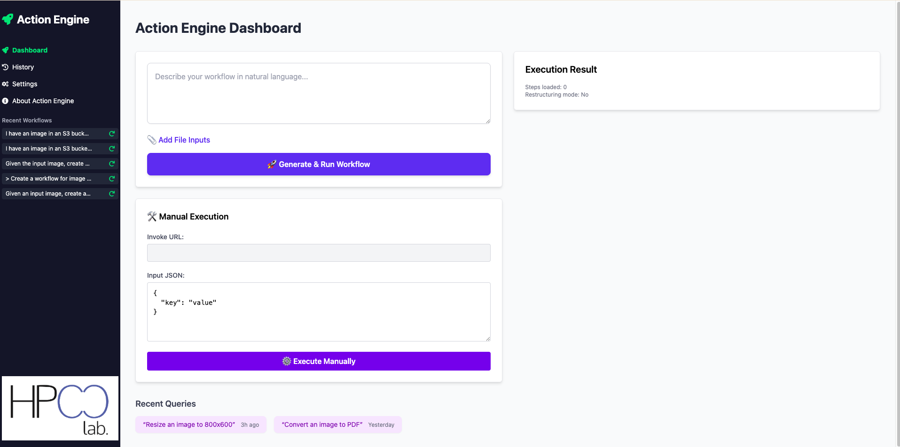

# 🧠⚙️ Action Engine: Automatic Workflow Generation in FaaS

**Authors**: Akiharu Esashi, Pawissanutt Lertpongrujikorn, Mohsen Amini Salehi  
📍 University of North Texas  
🔗 [Project Website](https://hpcclab.org/) | 📜 [Preprint](UnderReview)

---

## 🚀 Overview

**Action Engine** is an end-to-end system that **automates the generation of serverless (FaaS) workflows** from natural language queries using **Tool-Augmented Large Language Models (LLMs)**.

💡 **Why it matters:**  
Creating FaaS workflows traditionally requires manual effort, specialized platform knowledge (e.g., AWS Step Functions, Google Cloud Composer), and tight coupling with provider-specific APIs. Action Engine **eliminates these challenges** by generating executable, platform-independent workflows from human-readable descriptions — **no manual orchestration needed**.


## ⚙️ System Requirements

### Prerequisites

- **Python 3.8+**
- **AWS Account** with Step Functions and S3 permissions
- **AWS CLI** configured with credentials (`aws configure`)
- **Node.js** (required for the React-based frontend in `/frontend`)
- **pip** (Python package manager)
- **API Keys/Tokens** (depending on your LLM choice):
  - **OpenAI API Key** (for GPT-4o, GPT-3.5) - Get from [OpenAI Platform](https://platform.openai.com/api-keys)
  - **Hugging Face Token** (for Hugging Face models) - Get from [Hugging Face Settings](https://huggingface.co/settings/tokens)

---

# 🚀 Dashboard Setup Guide


> **Note:** This workflow system is currently designed to run on AWS, leveraging AWS Step Functions, Lambda, and S3 for workflow orchestration, serverless execution, and file storage. With additional development, it could be adapted to other cloud providers (such as Azure Logic Apps, Google Cloud Workflows, etc.).

---

### Step 1: Clone and Navigate

```bash
git clone https://github.com/Doonshin/action_engine.git
cd action_engine
```

### Step 2: Create Virtual Environment

```bash
# Create virtual environment
# On Linux/macOS:
python3 -m venv venv
# On Windows:
# python -m venv venv

# Activate virtual environment
# On Linux/macOS:
source venv/bin/activate
# On Windows:
# venv\Scripts\activate
```

### Step 3: Install Dependencies

```bash
pip install -r requirements.txt
```

### Step 4: Configure Environment Variables

Create a `.env` file in the project root with your credentials:

```env
AWS_ACCOUNT_ID=YOUR_ACCOUNT_ID
AWS_ACCESS_KEY_ID=YOUR_AWS_ACCESS_KEY_ID
AWS_SECRET_ACCESS_KEY=YOUR_AWS_SECRET_ACCESS_KEY
AWS_DEFAULT_REGION=us-east-2
AWS_ROLE_ARN=arn:aws:iam::YOUR_ACCOUNT_ID:role/StepFunctionExecutionRole
OPENAI_API_KEY=sk-xxxxxxxxxxxxxxxxxxxxxxxxxxxxxxxxxxxxxxxxxxxxxxxx
HUGGINGFACE_TOKEN=hf_xxxxxxxxxxxxxxxxxxxxxxxxxxxxxxxxxxxxxxxxx
```

### Step 5: Configure AWS IAM Permissions

Your AWS user needs the following permissions:

**Required IAM Policies:**
- `AWSStepFunctionsFullAccess` - For creating and managing Step Functions
- `AWSLambdaRole` - For Lambda function execution
- `IAMFullAccess` - For IAM role management
- `S3AutomaticWorkflowFilesAccess` - For S3 file operations

**How to attach policies:**

1. Go to **AWS Console** → **IAM** → **Users**
2. Click on your user (e.g., `action-engine-test`)
3. Go to **"Permissions"** tab
4. Click **"Add permissions"**
5. Choose **"Attach existing policies directly"**
6. Search and select the required policies:
   - `AWSStepFunctionsFullAccess`
   - `AWSLambdaRole` 
   - `IAMFullAccess`
7. Click **"Next"** and **"Add permissions"**

### Step 6: Start the Application

#### Start Backend Server
In your project root directory:
```bash
uvicorn main:app --reload
```

#### Start Frontend Development Server
Open a new terminal tab/window:
```bash
cd frontend
npm install
npm start
```

**Access Points:**
- 🌐 **Frontend Dashboard**: `http://localhost:3000`
- 🔗 **API**: `http://127.0.0.1:8000`
- 📚 **API Documentation**: `http://127.0.0.1:8000/docs`

### Step 7: Try Demo Workflows

> **⚠️ Important:** Before running demos, you must deploy the required Lambda functions to AWS. The workflows will fail if these functions don't exist in your AWS account.

#### 🎵 Demo 1: Music Recommendation Workflow

**Required Lambda Functions:**
- `username2id` - Converts user name to user ID
- `getusermood` - Determines user's mood  
- `recommendsong` - Recommends song based on mood
- `playmusic` - Returns music playing message

**Setup Steps:**
1. **Deploy Lambda Functions:**
   - Find the folder `Music Recommendation Workflow/` in the repository
   - Go to **AWS Lambda Console**
   - For each function:
     - Click **"Create function"**
     - Select **"Author from scratch"**
     - Enter the function name correctly
     - Select **Python 3.13** as runtime
     - Click **"Create Function"**
     - Upload the corresponding `.zip` file

2. **Run the Demo:**
   - Open the Action Engine Dashboard at `http://localhost:3000`
   - Enter this query in the workflow box:
     ```
     It will be perfect if you play music that matches my mood. This is Anna.
     ```
   - Click **"Generate & Run Workflow"**
   - Wait for execution

**Expected Result:**
The workflow will:
- Convert the user name to a user ID
- Detect the user's mood
- Recommend a song
- Return a message like: `Now playing: Happy Tune`

---

#### 🖼️ Demo 2: S3 Image Resize Workflow

**Required Lambda Functions:**
- `getimagefroms3` - Retrieves image from S3
- `resizeimage` - Resizes image to specified dimensions
- `uploadimagetos3` - Uploads processed image to S3
- `generatepublicurl` - Generates public URL for the image

**Setup Steps:**
1. **Deploy Lambda Functions:**
   - Find the folder `S3_Image_Resize_Workflow_Functions/` in the repository
   - Go to **AWS Lambda Console**
   - For each function:
     - Click **"Create function"**
     - Select **"Author from scratch"**
     - Enter the function name correctly
     - Select **Python 3.13** as runtime
     - Click **"Create Function"**
     - Upload the corresponding `.zip` file

2. **Configure Dependencies:**
   For functions like `resizeimage` that use PIL, you'll need to include the Pillow library:
   - Use a Lambda Layer with Pillow
   - Create a deployment package with Pillow included
   - Use the AWS-provided Pillow layer

3. **Run the Demo:**
   - Open the Action Engine Dashboard at `http://localhost:3000`
   - Upload an image file using the **"Add File Inputs"** button
   - Enter this query in the workflow box:
     ```
     Create a workflow that retrieves an image from S3, resizes it to 256x256 and returns the public URL of the resized image for display in the UI
     ```
   - Click **"Generate & Run Workflow"**
   - Wait for execution

**Expected Result:**
The workflow will:
- Retrieve the uploaded image from S3
- Resize it to 256x256 pixels
- Upload the resized image back to S3
- Return a public URL for the resized image

---

## 🖥️ Dashboard Usage Guide

The Action Engine dashboard provides an intuitive web interface for generating, running, and managing workflows.

### 🏠 Dashboard Access
- Navigate to `http://localhost:3000` in your browser
- View recent workflows, execution results, and query history
- Monitor workflow status and performance

### 📁 File Upload Feature
- Click **"Add File Inputs"** to upload files
- Supported file types: images, documents, and other common formats
- Files are automatically uploaded to S3 and URLs are provided for workflow use

### ⚡ Workflow Generation
1. **Enter Query**: Describe your desired workflow in natural language
2. **Attach Files** (optional): Upload any required input files
3. **Generate**: Click **"Generate & Run Workflow"**
4. **Process**: The system will:
   - Parse your natural language query
   - Generate an optimized workflow
   - Compile it to AWS Step Functions format
   - Deploy and execute the workflow
   - Return results in real-time

### 🔧 Manual Execution
- Use the **"Manual Execution"** section for advanced users
- Invoke workflows directly by URL with custom JSON input
- Useful for testing and automation scenarios

### 📊 Monitoring & Results
- View workflow execution logs and status
- Download results and generated files
- Access detailed execution traces for debugging

---

## 📬 Contact

For questions, support, or collaboration opportunities:

- 📧 **Akiharu Esashi**: [akiharuesashi@my.unt.edu](mailto:akiharuesashi@my.unt.edu)  
- 💼 **Mohsen Amini Salehi**: [mohsen.aminisalehi@unt.edu](mailto:mohsen.aminisalehi@unt.edu)
- 🏛️ **University of North Texas** - [HPC Lab](https://hpcclab.org/)

---

<div align="center">

**⭐ Star this repository if you find it helpful!**

[](https://github.com/Doonshin/action_engine)

</div>
